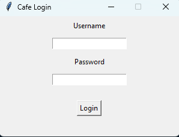
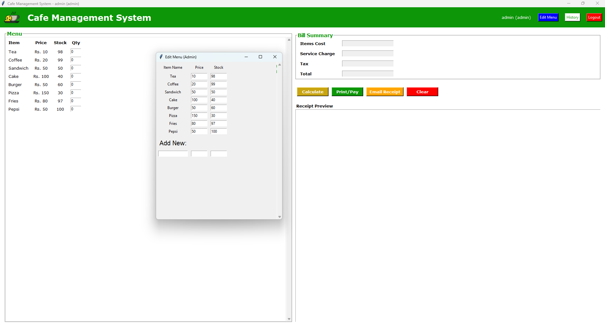
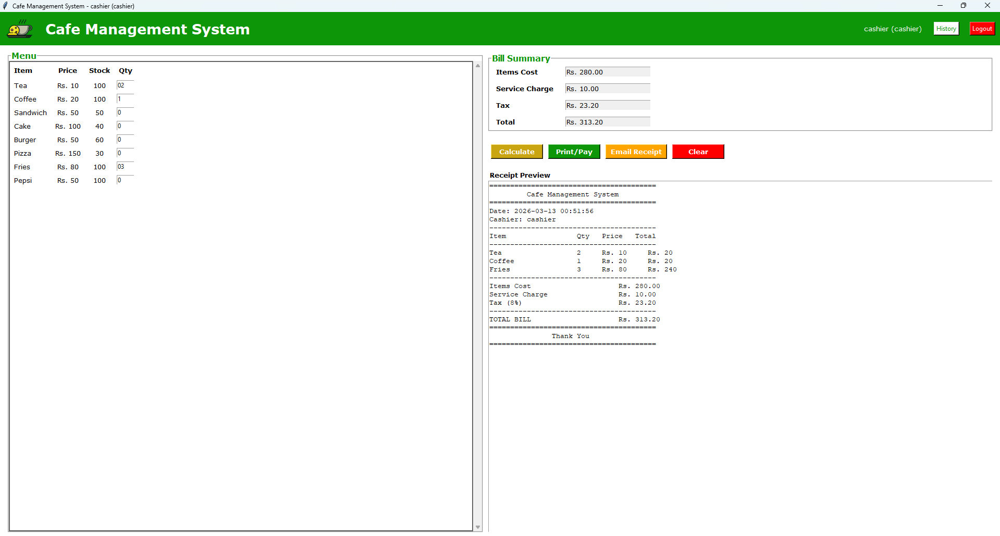
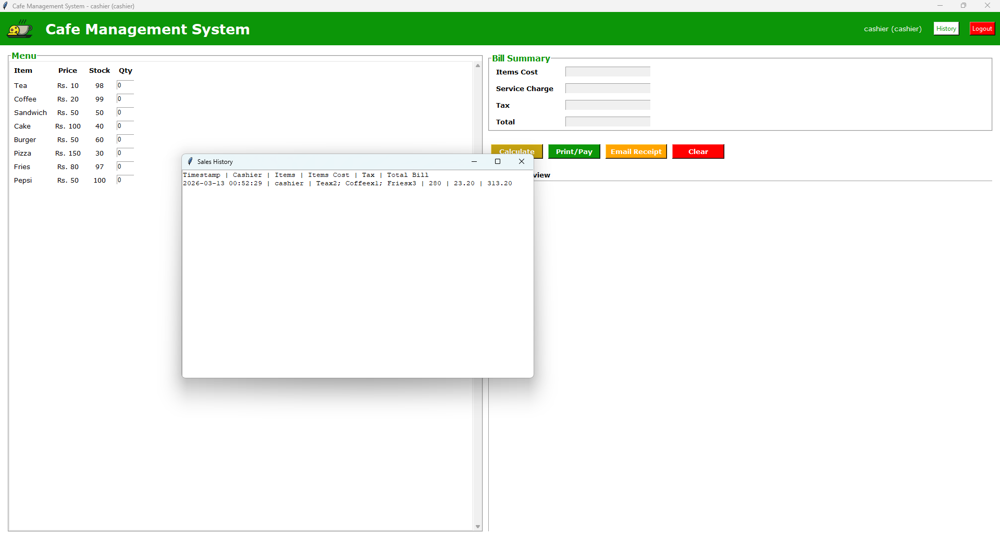

# Cafe Management System



A production‑ready, Python‑based **Cafe Management System** featuring a desktop GUI built with Tkinter. The application provides a complete workflow for small cafe operations including user roles, dynamic menus, inventory control, sales logging, receipt generation, and optional email delivery.

> **Note:** The repository already contains sample data in the `data/` folder and an example receipt in `receipts/` to help you get started.

## Features

- **Role-Based Access Control**
  - **Admin**: manage menu items (add/edit prices & stock), view history, and process sales.
  - **Cashier**: limited to processing orders and viewing transaction history.
- **Dynamic Menu**: menu items and pricing are read from `data/menu.json` at runtime.
- **Inventory Management**: stock levels update automatically; prevents sales when items are out of stock; admins can replenish stock via the interface.
- **Sales Logging**: each transaction is appended to `data/sales_history.csv` for later analysis.
- **Receipt Generation**
  - Text‑based receipts are saved under `receipts/` with timestamps.
  - Optional email delivery using SMTP settings in `data/config.json`.
- **User-Friendly GUI**: simple, responsive layout built using Tkinter with support for maximized windows.

### Screenshots






*(Screenshots are located in the repo under a new `screenshots/` folder.)*

## Prerequisites

- **Python** 3.8 or newer installed and available on the `PATH`.
- The following Python packages (see `requirements.txt`):
  - `Pillow` (image support for Tkinter)
  - `pytest` (used by the provided unit tests)

The project is lightweight and works on Windows, macOS, and Linux as long as Tkinter is installed.

## Installation

1. Clone or download the repository:
   ```bash
   git clone https://github.com/<your-username>/cafe-management-system.git
   cd cafe-management-system
   ```
2. (Optional) create and activate a virtual environment:
   ```bash
   python -m venv .venv
   source .venv/bin/activate   # Windows: .\.venv\Scripts\activate
   ```
3. Install dependencies:
   ```bash
   pip install -r requirements.txt
   ```

## Usage

1. Launch the program:
   ```bash
   python main.py
   ```
2. Authenticate with one of the default users (modify `data/users.json` to add or change accounts):
   - **Admin** — Username: `admin`, Password: `admin123`
   - **Cashier** — Username: `cashier`, Password: `cafe2024`
3. Navigate the main window:
   - Select item quantities from the left-hand menu.
   - Press **Calculate** to display item cost, tax, service charge, and total.
   - **Print/Pay** to complete the sale (automatically updates stock, generates a receipt, and logs the transaction).
   - **Email Receipt** to dispatch the receipt over SMTP (requires proper settings in `data/config.json`).
   - **History** opens a dialog showing prior sales from the CSV file.
   - **Edit Menu** (admin only) opens a separate window to change prices, stock, or add new items.
   - **Logout** returns you to the login screen.

Refer to the screenshots above for examples of each state.

## Configuration

The application reads its data from JSON files located in the `data/` directory:

- **Menu** (`data/menu.json`): an object mapping item names to `{ "price": <number>, "stock": <int> }`.
  You may edit this file directly or use the admin UI.
- **Users** (`data/users.json`): defines credentials and roles. Example:
  ```json
  {
      "admin":   { "password": "admin123", "role": "admin" },
      "cashier": { "password": "cafe2024",  "role": "cashier" }
  }
  ```
- **General Settings** (`data/config.json`): contains global values such as tax rate, service charge, currency symbol, and SMTP configuration for emailing receipts.
  ```json
  {
      "tax_rate": 0.08,
      "service_charge": 10,
      "currency": "Rs.",
      "smtp": {
          "server": "smtp.gmail.com",
          "port": 587,
          "sender_email": "your-email@gmail.com",
          "password": "your-app-password"
      }
  }
  ```

> **Tip:** Back up these files before making changes, especially in a production environment.

## Testing

A basic test suite is provided under `tests/` to verify backend functionality.

Run tests with `pytest`:
```bash
# on macOS / Linux
export PYTHONPATH=$PYTHONPATH:.
pytest tests/

# on Windows (PowerShell)
$env:PYTHONPATH="${env:PYTHONPATH};."
pytest tests/
```

Feel free to extend the tests when adding new features.

## Contributing

Contributions are welcome! Please fork the repository, create a feature branch, and submit a pull request. Ensure any new functionality is covered by tests and update this README as needed.

## License

This project is released under the [MIT License](LICENSE) ✨

## Acknowledgements

* Built with Python and Tkinter
* Inspired by typical point‑of‑sale systems used in cafes
